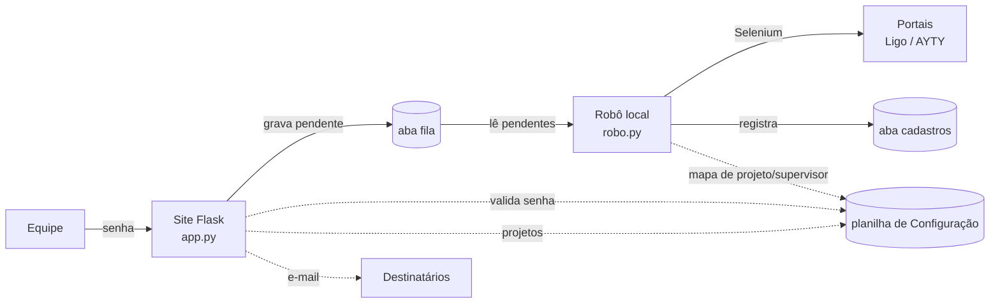

# Automação de Cadastros — Assisty

Sistema de **onboarding e offboarding de operadores** nos portais de discagem
(CRM Ligo e AYTY). Uma equipe registra as solicitações por um site protegido por
senha; um robô local as executa nos portais via Selenium e mantém a planilha de
usuários sempre em dia.

---

## Sumário

- [Visão geral](#visão-geral)
- [Arquitetura](#arquitetura)
- [Fluxo de dados](#fluxo-de-dados)
- [Estrutura do projeto](#estrutura-do-projeto)
- [Stack](#stack)
- [Pré-requisitos](#pré-requisitos)
- [Configuração](#configuração)
- [Instalação e execução](#instalação-e-execução)
- [As planilhas](#as-planilhas)
- [Notificações por e-mail](#notificações-por-e-mail)
- [Deploy do site](#deploy-do-site)
- [Segurança](#segurança)
- [Status](#status)

---

## Visão geral

| | |
|---|---|
| **Problema** | Cadastrar e distratar operadores nos portais é manual, repetitivo e sujeito a erro. |
| **Solução** | Um formulário web enfileira solicitações; um robô as processa nos portais e registra o resultado. |
| **Fonte da verdade** | Google Sheets — uma planilha de configuração (senha, mapa de projetos, e-mails) e uma de registro (usuários + fila). |

O site é **hospedável** (um link com senha para a equipe). O robô roda **localmente**,
pois depende do Chrome e do login nos portais.

---

## Arquitetura



O desacoplamento por **fila** é intencional: o site pode viver na nuvem, o robô na
máquina do operador. A planilha `cadastros` é escrita **após** a ação no portal —
ela é o registro do que já foi efetivado.

---

## Fluxo de dados

Cada linha `pendente` da aba `fila` é resolvida pelo robô conforme o caso:

| Situação | Detecção | Ação no portal | Efeito na aba `cadastros` |
|---|---|---|---|
| **Cadastro — novo** | CPF não existe | cria o usuário | nova linha (`Matrícula` sequencial, `Ativo=Sim`, `Data de Criação`) |
| **Cadastro — retorno** | CPF já existe | reativa | `Ativo=Sim` + `Retorno` |
| **Distrato** | — | desativa | `Ativo=Não` + `Data de Inativação` |

### Regras de negócio já implementadas

- **Login do operador** — deriva do CPF: começa pelos **4 primeiros dígitos** e,
  em caso de colisão, **estende +1 dígito** até ser único. A unicidade é
  verificada no **próprio portal** (o robô lê o aviso "Login já existe" e tenta o
  próximo tamanho); o aviso "CPF já existe" indica **colaborador antigo** → o
  fluxo vira **retorno**.
- **Matrícula** — sequencial (maior existente + 1).
- **Projeto** — cada operador recebe acesso ao projeto correspondente em cada
  portal, resolvido pela aba `mapa_projeto` (ver [As planilhas](#as-planilhas)).
- **Supervisor** — **não** é escolhido no formulário; vem do `mapa_projeto`, com
  uma coluna por portal (`Supervisor Ligo` e `Supervisor AYTY`).
- **Distrato / Retorno no portal:**
  - **Ligo** — apenas alterna a flag *Ativo* do usuário (desmarca no distrato,
    marca no retorno).
  - **AYTY** — alterna a flag *Ativo* **e** troca o superior: no distrato realoca
    para `teste code7`; no retorno devolve o superior do `mapa_projeto`.

---

## Estrutura do projeto

```
automacao_cadastros/
├── .env                     # segredos e configuração (fora do Git)
├── .env.example             # modelo do .env (sem segredos)
├── credentials_google.json  # conta de serviço do Google (fora do Git)
├── requirements.txt
├── README.md
├── inspecao/                # HTMLs de referência dos portais (mapeamento de seletores)
└── src/
    ├── app.py         # site Flask: login, formulário, gravação na fila
    ├── robo.py        # orquestrador local: fila → portal → cadastros
    ├── config.py      # configuração central, tipada, lida do .env
    ├── utils.py       # funções puras: CPF, datas, geração de login
    ├── modelos.py     # dataclasses e enums de domínio
    ├── planilhas.py   # cliente Google Sheets + repositórios (fila, cadastros, mapa)
    ├── portais.py     # Selenium: PortalBase, PortalLigo, PortalAyty
    ├── templates/     # login.html, index.html
    └── static/        # style.css
```

**Separação de responsabilidades:** domínio puro (`utils`, `modelos`),
persistência (`planilhas`), automação (`portais`), orquestração (`robo`) e
interface (`app`, `templates`). Site e robô compartilham `config`, `utils` e
`planilhas` — sem duplicação.

---

## Stack

- **Python 3.12**
- **Flask** — site e sessão de login
- **gspread + google-auth** — Google Sheets via conta de serviço
- **Selenium** — automação dos portais no Chrome (o **Selenium Manager**, embutido,
  resolve o ChromeDriver automaticamente — nada de baixar driver à mão)
- **python-dotenv** — configuração por `.env`
- **Gunicorn** — servidor de produção (deploy)

---

## Pré-requisitos

- Python 3.12+
- Google Chrome instalado (para o robô)
- Uma conta Google com acesso ao Google Cloud e ao Google Drive

---

## Configuração

### 1. Conta de serviço do Google

1. Em <https://console.cloud.google.com/>, crie um projeto.
2. Ative **Google Sheets API** e **Google Drive API**.
3. **APIs e serviços → Credenciais → Criar credenciais → Conta de serviço**.
4. Na conta criada: **Chaves → Adicionar chave → JSON**; baixe o arquivo.
5. Salve-o como **`credentials_google.json`** na raiz do projeto.
6. Copie o e-mail da conta (`...@....iam.gserviceaccount.com`).

### 2. Planilhas

Crie duas planilhas e **compartilhe ambas** com o e-mail da conta de serviço
(perfil **Editor**). Ver [As planilhas](#as-planilhas) para o esquema de colunas.

### 3. Arquivo `.env`

Copie `.env.example` para `.env` e preencha:

```ini
FLASK_SECRET_KEY=<chave aleatória longa>
GOOGLE_CREDENTIALS_FILE=credentials_google.json

SHEET_CREDENCIAIS_ID=<id da planilha de configuração>
SHEET_REGISTROS_ID=<id da planilha de registros>

# Nomes das abas
ABA_SENHA=senha
ABA_EMAILS=emails
ABA_MAPA=mapa_projeto
ABA_PORTAL=cadastros
ABA_FILA=fila

# Credenciais dos portais (ficam SÓ aqui, nunca na planilha nem no Git)
LIGO_USER=<usuario do CRM Ligo>
LIGO_PASSWORD=<senha do CRM Ligo>
AYTY_USER=<usuario do AYTY>
AYTY_PASSWORD=<senha do AYTY>

# Notificações (opcional) — Gmail exige "senha de app"
SMTP_HOST=smtp.gmail.com
SMTP_PORT=587
SMTP_USER=
SMTP_PASSWORD=
EMAIL_FROM=
```

> O **ID** da planilha é o trecho da URL entre `/d/` e `/edit`.

Opcionais (têm padrão no código): `URL_LIGO`, `URL_AYTY` e
`AYTY_SUPERVISOR_DISTRATO` (padrão `teste code7`).

---

## Instalação e execução

```bash
pip install -r requirements.txt
```

### Site (formulário)

```bash
python src/app.py
```

Acesse <http://localhost:5000> e entre com a senha definida em `senha_formulario`.

### Robô (processa a fila nos portais)

```bash
python src/robo.py --portal ligo             # processa no Ligo
python src/robo.py --portal ayty             # processa no AYTY
python src/robo.py --portal ambos            # Ligo e depois AYTY (usado no Cron)
python src/robo.py --portal ambos --dry-run  # simula, sem navegador nem gravação
```

O modo `--dry-run` é seguro para inspeção: lê a fila, mostra o que faria
(matrícula, login, ações) e **não** abre o Chrome nem escreve nas planilhas.

---

## As planilhas

### Planilha de Configuração (`SHEET_CREDENCIAIS_ID`)

**Aba `senha`** — senhas de acesso ao site:

| senha_formulario | senha_distrato |
|---|---|
| `sua-senha-do-site` | `sua-senha-de-distrato` |

`senha_formulario` libera o acesso geral ao formulário; `senha_distrato` é exigida
**a mais**, no envio de um distrato (o cadastro não pede). As credenciais dos
portais **não** ficam aqui — moram no `.env`.

**Aba `mapa_projeto`** — o coração do roteamento. Para cada projeto do formulário,
diz o nome equivalente em cada portal, o tipo de usuário e o supervisor por portal:

| Projeto | Ligo | AYTY | Tipo | Supervisor Ligo | Supervisor AYTY |
|---|---|---|---|---|---|
| CPFL | ASSISTY - CPFL | ASSISTY - CPFL CRM CLOUD | Ativo | SUPERIOR NAO CADASTRADO | INCUBADORA CPFL |
| ENELSP | ASSISTY - ENEL | ENEL | Ativo | SUPERIOR NAO CADASTRADO | INCUBADORA ENEL |
| … | … | … | … | … | … |

A **primeira coluna (`Projeto`)** é a lista que aparece no formulário.

**Aba `emails`** — destinatários das notificações:

| Email |
|---|
| pessoa@empresa.com |

### Planilha de Registros (`SHEET_REGISTROS_ID`)

**Aba `cadastros`** — espelho dos usuários do portal:

| Matrícula | Nome | Ativo | CPF | Superior | Nível de Acesso | Data de Criação | Data de Inativação | Retorno |
|---|---|---|---|---|---|---|---|---|

**Aba `fila`** — solicitações a processar (criada automaticamente):

| Carimbo | Tipo | Nome | CPF | Nascimento | Projeto | Superior | Nível de Acesso | Status Ligo | Status AYTY | Erro |
|---|---|---|---|---|---|---|---|---|---|---|

`Tipo` ∈ {`cadastro`, `distrato`} · cada `Status …` ∈ {`pendente`, `processado`, `erro`}.
Há **uma coluna de status por portal**: o mesmo item fica pendente no AYTY mesmo
depois de processado no Ligo (e vice-versa), então o robô consegue tocar os dois
portais de forma independente. A coluna `Superior` fica vazia — o supervisor vem
do `mapa_projeto`. A coluna `Erro` guarda o detalhe de qualquer falha, por portal
(ex.: `[ligo] timeout ao clicar em Adicionar | [ayty] CEP invalido`); o segmento
de um portal é apagado assim que ele processa aquele item com sucesso.

---

## Notificações por e-mail

A cada solicitação, o site avisa os endereços da aba `emails`.
Para Gmail, gere uma **senha de app** (<https://myaccount.google.com/apppasswords>,
requer verificação em 2 etapas) e preencha `SMTP_USER`, `SMTP_PASSWORD` e
`EMAIL_FROM` no `.env`. Sem SMTP configurado, o envio é silenciosamente ignorado.

---

## Deploy na nuvem

O projeto vira **dois serviços separados** no Railway (mesmo repositório, cada um
com seu `Dockerfile` e suas variáveis) — ver o guia detalhado em
[`deploy/README.md`](deploy/README.md).

| Serviço | Dockerfile | Papel | Credenciais que recebe |
|---|---|---|---|
| **site** | `deploy/site.Dockerfile` | formulário Flask (gunicorn) | Google + `FLASK_SECRET_KEY` + SMTP |
| **robo** | `deploy/robo.Dockerfile` | processa a fila (Selenium/Chromium), roda como **Cron** 1×/dia | Google + `LIGO_*`/`AYTY_*` |

A separação é de **segurança**: o site **não** recebe as senhas dos portais, então
elas nunca ficam na máquina exposta à internet. O robô roda oculto (`HEADLESS=1`),
usa o Chromium do container e, a cada execução, processa os dois portais e encerra —
checando a fila **antes** de abrir o Chrome (dias vazios saem em segundos).

Variáveis de ambiente relevantes ao deploy: `GOOGLE_CREDENTIALS_JSON` (o JSON da
conta de serviço inteiro, no lugar do arquivo), `HEADLESS`, `FLASK_DEBUG` (fica
desligado em produção), `CHROME_BINARY`/`CHROMEDRIVER_PATH` (o Dockerfile do robô
já define).

---

## Segurança

- `.env` e `credentials_google.json` **nunca** vão para o Git nem para as imagens
  Docker (protegidos por `.gitignore` e `.dockerignore`).
- **Nenhuma credencial chega ao navegador** — todas são usadas só no servidor. O
  front recebe apenas a lista de projetos e níveis; mensagens de erro são genéricas
  (o detalhe fica no log do servidor).
- **Menor privilégio:** as senhas dos portais ficam **só no serviço do robô**; o
  site nunca as recebe.
- `FLASK_DEBUG` fica **desligado** em produção (o debugger do Flask seria um vetor
  de execução de código pelo navegador); em produção o site roda sob **gunicorn**.
- A senha de acesso ao site fica na aba `senha`; validada no servidor com comparação
  de tempo constante (`hmac.compare_digest`).
- Notificações por e-mail usam **senha de app**, nunca a senha principal da conta.

---

## Status

**Pronto e testado (end-to-end nos dois portais)**

- ✅ Site com login por senha; projetos e nível de acesso no formulário
- ✅ Projetos do formulário puxados da aba `mapa_projeto`
- ✅ Gravação de cadastro/distrato na fila
- ✅ Robô: leitura da fila, detecção novo/retorno por CPF, matrícula sequencial
- ✅ **Cadastro novo** no portal (Ligo e AYTY), coreografia por projeto
- ✅ **Distrato** no portal — desativa a flag *Ativo* (AYTY também realoca o superior)
- ✅ **Retorno** no portal — reativa quem já existe (AYTY devolve o superior)
- ✅ **Unicidade do login** verificada no próprio portal (estende o prefixo do CPF)
- ✅ **Supervisor** resolvido pelo `mapa_projeto`, por portal (não mais pelo formulário)
- ✅ **Pronto para a nuvem**: site e robô separados em dois serviços (Railway), robô
  headless com Chromium no container, rodando como Cron 1×/dia (`--portal ambos`)
